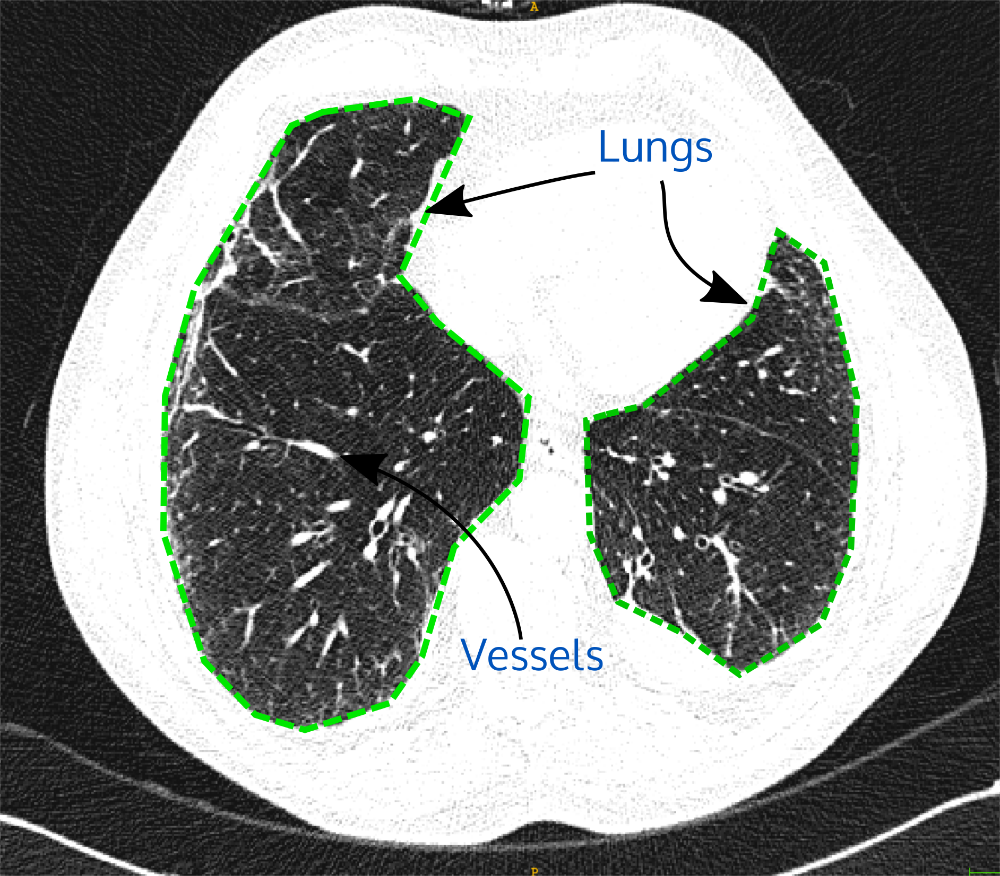

# Medical Image Analysis
**Dataset:** 21 medical images (2D) in NIFTI format (filename extension slicexxx.nii.gz) from chest CT scan. Data are encoded in Hounsfield units (HU). Those 2D sections are axial slices of the lungs.
In those images, most of the bright voxels within the lung parenchyma represent vessels (see Figure 1). Most normal lung parenchyma is below –300 HU and above –1000 HU. 

*Figure 1. Example 2D slice image of the chest CT scan with lung outlined in green. Current viewing window settings: level=-600HU and width=1000HU.*
**Tasks:** 
1. For each image, segment the lung in the image (excluding bowels, trachea and other dark regions outside the lung) and compute the lung area in mm². 
2. For each image, segment the main vessels voxels with values higher than -500 HU and compute the relative vessels over lung area in % (vessel-lung area ratio).
3. For the whole dataset, based on the vessel-lung area ratio divide the cases into 2 sub-groups of images based on similar characteristics.
